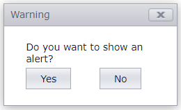

# Popup Control for ASP.NET Web Forms - How to create a confirmation dialog
<!-- run online -->
**[[Run Online]](https://codecentral.devexpress.com/t546332/)**
<!-- run online end -->

This example demonstrates how to use a pop-up window to display a confirmation dialog box.



## Overview

Create a popup control and use the [SetContent](https://docs.devexpress.com/AspNetMvc/DevExpress.Web.Mvc.PopupControlSettingsBase.SetContent.overloads) method to populate the control with labels and buttons.

```cshtml
@Html.DevExpress().PopupControl(settings => {
    settings.SetContent(() => {
       //label and buttons
    });
}).GetHtml()
```

Create a JS function to show a pop-up window and add a handler to the **Yes** button `Click` event.

```cshtml
(function() {
    'use strict';
    window.dxConfirm = function(text) {
        if (text && text.length)
            ConfirmLabel.SetText(text);

        ConfirmYes.Click.ClearHandlers();
        ConfirmYes.Click.AddHandler(Hide);

        ConfirmPopup.Show();
        return {
            success: function(onSuccess) {
                ConfirmYes.Click.AddHandler(onSuccess);
            }
        };
    };
    function Hide() {
        ConfirmPopup.Hide();
    }
})();
```

After a user clicks the **Yes** button, an alert message is shown.

```js
dxConfirm("Do you want to show an alert?")
    .success(function() {
        alert("success");
    });

```

## Files to Review

* [dxConfirm.js](./CS/T545638/Scripts/dxConfirm.js)
* [Index.cshtml](./CS/T545638/Views/Home/Index.cshtml)
* [_Layout.cshtml](./CS/T545638/Views/Shared/_Layout.cshtml)
* [ConfirmPopup.cshtml](./CS/T545638/Views/Shared/ConfirmPopup.cshtml)
